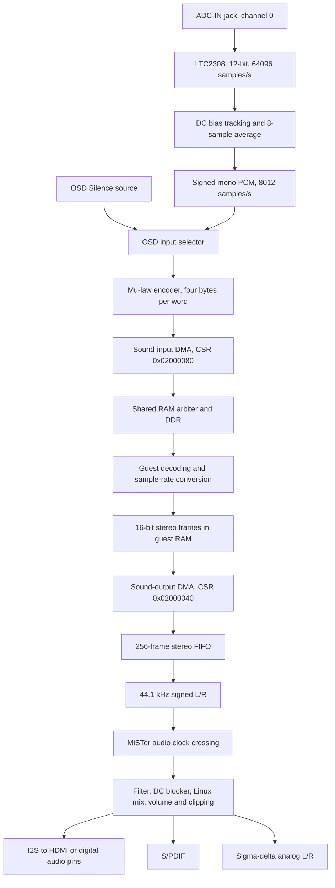

# Audio path audit — 12 September 2026

This report records the defects in commit `04bb7579`. The subsequent
[audio fixes and validation](AUDIO_FIXES.md) address these findings. Original
diagnostic logs are preserved locally in `tb/build/audio_audit_baseline/`;
the current audit runner checks the corrected implementation.

Audited commit `04bb75795171255391bad897e14eb702b27715a4` (`Fix recording DMA
lockup and add ADC audio input`). The RTL fingerprints match the September 12
recording/ADC RBF build. This audit adds diagnostic benches and this report;
it does not change RTL or load a core onto the MiSTer.

The basic capture data path and normal stereo output work in simulation.
Four NeXT playback/control defects were reproduced, the capture filter admits
strong aliases, ADC pin timing is unconstrained, and MiSTer's S/PDIF transmitter
reports the wrong sample rate in 96 kHz mode. The latter is framework code.

## Findings

### 1. P1 — Sound-output DMA reset does not cancel pending work

Location: [next_kms_snd.sv](https://github.com/MiSTer-devel/NeXT_MiSTer/blob/04bb75795171255391bad897e14eb702b27715a4/rtl/next/next_kms_snd.sv#L594), CSR reset and
the `E_RD`/`E_ACK` engine at lines 648–679; FIFO push at line 217.

`RESET` clears CSR flags, but a pending request remains live without a
cancellation marker. Its eventual response enters the FIFO, advances the
current `s_next`, and can reassert COMPLETE. This matters when software aborts
and replaces a descriptor while a request is waiting for the shared RAM bus.

Reproduction: reset a pending one-frame read at `04002000`. Its delayed ACK
produces `CSR=08`, `next=04002004`, and one queued frame. Reprogramming next
to `04003000` before that ACK instead produces `04003004`, skipping the first
frame of the replacement descriptor. The memory address still belongs to the
old request. This is a reproduced RTL race, not proof that it caused any
particular live lockup.

Fix: preserve the bus request until its response, but discard cancelled
responses before FIFO insertion, pointer updates, chaining, or interrupt
generation. Give reset priority over a response on the same clock. The input
channel already has this cancellation behavior.

### 2. P1 — KMS software reset leaves both audio directions running

Location: [next_kms_snd.sv](https://github.com/MiSTer-devel/NeXT_MiSTer/blob/04bb75795171255391bad897e14eb702b27715a4/rtl/next/next_kms_snd.sv#L445).

The valid command `FF` with data `FFFFFFFF` is a no-op. After starting both
directions and issuing it, the probe observes input active = 1, output active
= 1, and transmit status = `02`. The reference
[kms_reset](../reference/previous/src/kms.c#L535) stops both streams and clears
the KMS interface and its interrupts. Software relying on reset to quiesce
audio can therefore continue receiving requests or recording data.

Fix: implement KMS reset, including input status clearing and stopping new
transfers in both directions. Coordinate already-issued RAM work with DMA
cancellation; do not reset the unrelated DMA pointer registers merely because
KMS is reset.

### 3. P2 — Both 22.05 kHz playback modes run twice as fast

Location: [next_kms_snd.sv](https://github.com/MiSTer-devel/NeXT_MiSTer/blob/04bb75795171255391bad897e14eb702b27715a4/rtl/next/next_kms_snd.sv#L202) and
[sound-output command decoding](https://github.com/MiSTer-devel/NeXT_MiSTer/blob/04bb75795171255391bad897e14eb702b27715a4/rtl/next/next_kms_snd.sv#L430).

The decoder ignores mode bits 5:4 and always pops a new stereo frame at
44,100 Hz. The reference [snd_send_samples](../reference/previous/src/snd.c#L189)
implements normal mode, twofold sample repetition, and twofold zero insertion.

Measured source consumption in a 10 ms interval: commands `0F`, `1F`, and `3F`
all consume 441 frames. The latter two should consume 220 or 221 source frames.
22.05 kHz audio consequently has half its intended duration and twice its
intended frequency.

Fix: latch the mode and consume one source frame per two 44.1 kHz output ticks
in doubled modes, producing either the repeated frame or zero on the other
tick. Preserve this behavior through FIFO stalls and mode changes.

### 4. P2 — Guest volume and output processing commands are ignored

Location: [next_kms_snd.sv](https://github.com/MiSTer-devel/NeXT_MiSTer/blob/04bb75795171255391bad897e14eb702b27715a4/rtl/next/next_kms_snd.sv#L445).

The `C4` serial volume/control and `C2` direct volume commands have no effect.
The probe shifts a valid 11-bit `C4` transaction selecting both channels at
attenuation 43, which the reference maps to silence. Output remains
`L=1234, R=ABCD`. Guest volume adjustments cannot control the emitted samples.
The corresponding mute/de-emphasis processing is also absent by inspection.

Fix: implement the serial control protocol and applicable direct volume
command, then apply channel attenuation and the supported output processing
before handing samples to MiSTer. MiSTer's own volume control is downstream
and works independently; it does not implement the guest's registers.

### 5. P2 — ADC decimation has inadequate rejection above the recording band

Location: [next_audio_adc.sv](https://github.com/MiSTer-devel/NeXT_MiSTer/blob/04bb75795171255391bad897e14eb702b27715a4/rtl/next/next_audio_adc.sv#L24).

The 64,096 Hz stream is reduced to 8,012 Hz using an eight-sample box average.
DC tracking removes bias but does not provide the low-pass rejection needed
before decimation. Signals above the 4,006 Hz recording Nyquist frequency
fold into the recording unless the source is already adequately band-limited.

The serial ADC model supplies a 512-code-peak sine around code 2048. Results
after bias settling, measured before mu-law compression:

| ADC input | Recorded PCM spectral peak | Gain relative to nominal ×8 scaling |
|---|---:|---:|
| 1,000 Hz | 1,001.50 Hz | −0.26 dB |
| 5,000 Hz | 3,012.32 Hz | −6.48 dB |

Peak offsets reflect the 2,048-sample FFT resolution. The expected alias is
8,012 − 5,000 = 3,012 Hz. This is a substantial unwanted tone, not a byte-order
or mu-law defect. The model tests the digital path; the physical input board's
analog frequency response has not been measured.

Fix: choose a recording passband and stopband, then add a proper low-pass
decimation filter. Retain DC removal, signed headroom, and explicit sample
pacing. Validate tones across the passband and all alias bands.

### 6. P2 — ADC external timing has no constraints or established margin

Location: [NeXT.sdc](https://github.com/MiSTer-devel/NeXT_MiSTer/blob/04bb75795171255391bad897e14eb702b27715a4/NeXT.sdc), [sys_top.sdc](https://github.com/MiSTer-devel/NeXT_MiSTer/blob/04bb75795171255391bad897e14eb702b27715a4/sys/sys_top.sdc), and
[ltc2308.sv](https://github.com/MiSTer-devel/NeXT_MiSTer/blob/04bb75795171255391bad897e14eb702b27715a4/sys/ltc2308.sv#L39).

The original fitted [unconstrained-port report](../tb/build/audio_audit_baseline/NeXT.sta.rpt#L7841)
lists `ADC_SDO`, `ADC_SCK`, `ADC_SDI`, and `ADC_CONVST`. Positive internal
setup/hold slack therefore does not validate the ADC interface.

At 28 MHz, the controller produces 14 MHz SCK and a one-cycle, approximately
35.7 ns CONVST pulse. The first internal SDO capture occurs 45 clocks after
conversion launch: approximately 1.607 microseconds. The LTC2308 specifies
**1.6 microseconds maximum conversion time**; 1.3 microseconds is typical.
Only about 7 ns separates the internal events before accounting for FPGA I/O,
board delays, input setup, and uncertainty. Subsequent bits also need a
round-trip SCK-to-SDO timing budget. These figures come from the RTL and the
[Analog Devices datasheet, pages 5 and 14–15](https://www.analog.com/media/en/technical-documentation/data-sheets/2308fc.pdf).

This is a timing-validation gap and narrow nominal conversion margin, not a
measured physical timing failure. The zero-delay serial model cannot settle it.

Fix: add explicit interface timing constraints and conversion guard time,
budget SCK output delay plus ADC data-valid delay plus FPGA input delay, then
check the fitted paths at all corners. Confirm serial edges on hardware.

### 7. P2 — S/PDIF advertises 48 kHz when emitting at 96 kHz

Location: [sys/spdif.v](https://github.com/MiSTer-devel/NeXT_MiSTer/blob/04bb75795171255391bad897e14eb702b27715a4/sys/spdif.v#L175) and
[sys/audio_out.sv](https://github.com/MiSTer-devel/NeXT_MiSTer/blob/04bb75795171255391bad897e14eb702b27715a4/sys/audio_out.sv#L72).

The framework doubles the serializer enable rate for 96 kHz, but the S/PDIF
channel-status generator hardcodes frequency field `0x2`. The probe reads
`0x2` at both settings; 96 kHz requires `0xA`. These encodings also appear in
the Linux kernel's [IEC958 definitions](https://kernel.googlesource.com/pub/scm/linux/kernel/git/torvalds/linux/+/refs/tags/v7.0-rc3/include/sound/asoundef.h).

Receivers using channel status see incorrect metadata in 96 kHz mode. This
does not establish that every receiver loses audio. The default 48 kHz mode
has matching metadata.

Fix: pass the selected sample rate into the transmitter and generate matching
channel status. Treat this as a shared MiSTer framework change.

## Signal and control map



Guest conversion in the diagram is a software responsibility, not an
implemented automatic ADC-to-output loopback. Recorded bytes are mono mu-law;
the output FIFO accepts linear stereo words. DSP56001 support remains
unimplemented, as recorded in [PORTING.md](PORTING.md). The separate KMS `C7`
direct analog-output command is also still a no-op.

| Boundary | Trace and audit result |
|---|---|
| Physical input | Digital I/O includes ADC-IN; the separate adapter is for analog I/O v6.1. This core samples channel 0 only. It uses raw ADC amplitude, not the tape comparator. |
| ADC interface | `sys_top.v:1821` maps `{SCK, SDO, SDI, CONVST}` to `ADC_BUS[3:0]`; `ltc2308` drives single-ended channel 0, unipolar, awake configuration `100010`. The serial probe checks this command. |
| Capture clocks | ADC, bias/average logic, codec packing, DMA and KMS all use the real 28 MHz clock. Audio divisors use `CLK_REAL_HZ`, not the machine's virtual 50 MHz timing parameter. Both 8012 Hz rates derive from the same clock; there is no asynchronous crossing here. |
| Capture startup/reset | ADC toggle, bias acquisition and averaging state reset at the top-level reset. Device/CPU reset clears the input DMA and KMS; the ADC may continue bias tracking. Old ADC startup words are discarded. |
| Capture data | Signed conversion and all 65,536 mu-law codes pass. Four oldest-first bytes form each big-endian RAM word; 2,024 tone-driven DMA words pass the independent scoreboard. |
| RAM integration | Input uses `G_SNDIN`, a real RAM write master. Address checks reject accesses outside `04000000`–`07FFFFFF`; acknowledged writes enter the CPU cache snoop path (`next_system.sv:533`). |
| Interrupts | Input completion is system bit 22; output completion is bit 23; their KMS overrun/underrun OR is bit 8. Unit tests check that clearing one error source preserves the other. |
| Normal playback | Each RAM word is `{L[15:0],R[15:0]}`. FIFO backpressure limits prefetch to 256 frames. The FIFO drains correctly at 44.1 kHz in normal mode. Completion denotes fetching the buffer, not necessarily finishing audible output. |
| MiSTer handoff | `NeXT.sv:45` exports signed stereo (`AUDIO_S=1`, `AUDIO_MIX=0`). Framework `audio_out.sv:175` samples each channel through two registers and accepts equal consecutive values in the 24.576 MHz audio domain. Functional simulation passes; it is not a metastability proof. |
| Output processing | Framework filtering, DC removal, optional Linux audio, MiSTer volume/boost/mix and saturation feed all three serializers. Simulated asynchronous 44.1 kHz input preserves a 1 kHz left tone and 2 kHz right tone at both output rates. |
| Physical output routing | HDMI uses 24.576 MHz MCLK and I2S. Board configuration selects analog sigma-delta versus digital signals on shared audio pins (`sys_top.v:1564`). Electrical output levels, HDMI receiver behavior and analog filtering were not measured. |

## Reproducing and interpreting the checks

Run from the checkout with Verilator, a C++ toolchain, ripgrep and NumPy:

```sh
sh tb/run_audio_audit.sh
```

The original audit recorded six failed playback required-behavior checks
and one failed S/PDIF metadata check. The current runner checks the fixes
and exits nonzero if any required behavior regresses. The ADC
aliasing result is measured separately; missing timing constraints are from
static inspection and the fitted report. Diagnostic benches do not modify
the RTL and are separate from the existing regression runner.

Artifacts in `tb/build/audio_audit/`:

- `playback.log`: rate selection, legacy volume, delayed reset response,
  replacement descriptor, and KMS reset reproductions.
- `capture.log`: exhaustive mu-law comparison and serial ADC-to-DMA checks;
  `capture_*.csv` and `analysis.log` contain the tone measurements.
- `mister.log`: 480/960 I2S stereo frames per 10 ms, **54,964** decoded channel
  words matching the serializer inputs, and the S/PDIF metadata mismatch.
- `mister_*.csv` and `measurements.json`: downstream stereo tone measurements.
  With default filter coefficients, 4096/2048-peak source tones emerge at
  approximately 3982/1986 peak amplitude; each opposite-channel tone is below
  0.4 code in the joint sinusoidal fit.
- `input_regression.log` and `recording_regression.log`: existing input lifecycle
  and real-CPU recording/abort regressions pass again. Their RTL fingerprints
  match the prior validated build.

Fix the two reset defects first, then playback mode/volume behavior and the
recording filter. Establish ADC interface timing before declaring the jack
validated. Finish with physical recording/playback, stop/restart, mixed disk
and network load, and HDMI/analog/S/PDIF receiver checks. No new live memory
dump or physical audio test was performed during this audit.
