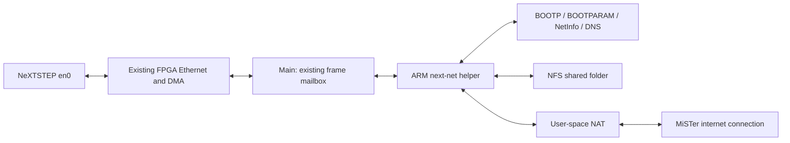

# NeXT virtual network — plan for review

Status: proposed, September 12, 2026. No implementation or deployment has
started. Baselines: NeXT `04bb757`, local Main_MiSTer `ce39817`.

## Intended result

Select **Network → Virtual** in the MiSTer OSD. A NeXTSTEP 3.3 installation
using automatic network configuration should boot through the configuration
server prompt, acquire its address and hostname, resolve names, and reach
TCP/UDP services through MiSTer's internet connection. A host shared folder
should be accessible through NeXT's native NFS client for file transfers.

The first supported setup is one guest booting from its existing disk,
with a small generated NetInfo network domain. Network boot, a general
multi-machine NetInfo server, inbound port forwarding, and automatic clock
changes are outside this first release. BlueSCSI CD switching remains a
separate project; NFS addresses the file-transfer requirement.

## Proposed architecture

Main supervises a separate ARM helper and exchanges Ethernet frames with
it over a private, nonblocking Unix socket. Main remains the sole owner of
the FPGA mailbox. The helper owns SLiRP, RPC services, and file operations.
This avoids putting network waits or SD-card file operations into Main's
UI/disk poll loop, and a helper restart discards the legacy library's
process-global state. The tradeoff is one additional executable to package.

Use the Previous implementation already in this repository. Its active
build uses `slirp/*.c` and **`slirp/rpc/*.c`**; the older C++ files under
`slirp/nfs/` are not in the current CMake source list. Import a documented
source snapshot into Main's tree, with its notices and a small POSIX host
adapter for configuration, threads, locks, timing, and logging. The MiSTer
build must not need SDL or the rest of the Previous emulator.

Add mode 5, **Virtual**, after the existing OSD network options. Status bits
`[54:52]` already have room, and the current Ethernet connection expression
accepts a nonzero mode. Most work belongs in ARM software. The expected RBF
change is the OSD entry; reset-generation signaling may need a small
mailbox addition if existing reset detection cannot reliably clear stale
frames. That will be settled in the integration milestone.

Virtual mode uses MiSTer's normal outbound sockets. BOOTP and the virtual
RPC services serve the guest network; they do not become configuration
servers on the physical LAN. Existing eth0, eth1, macvlan, and tap0 modes
retain their current behavior. Keep the current default network selection;
the user explicitly selects Virtual.

## Default configuration for review

| Item | Proposed value |
| --- | --- |
| Guest address and hostname | `10.0.2.15`, `next` |
| Guest subnet | `10.0.2.0/24` |
| Virtual gateway | `10.0.2.2` |
| Virtual DNS | `10.0.2.3` |
| BOOTPARAM / NetInfo / NFS server | `10.0.2.254`, `nfs` |
| Shared host directory | `/media/fat/games/NeXT/shared` |
| Share override | Existing `[NeXT]` `shared_folder` setting |
| Guest share discovery | Advertise `nfs:/` under `/Net`, then verify the actual automount path on 3.3 |
| File transfer access | Read/write within the selected shared directory |
| Helper installation path | `/media/fat/support/next/next-net` |

These addresses follow Previous's virtual subnet. Replace its `previous`
hostname consistently in BOOTPARAM, DNS, and NetInfo. Check for an upstream
network overlapping this subnet and document the limitation before release;
arbitrary runtime subnet configuration is not required for the first build.

Create the default shared directory if necessary. If it cannot be opened,
network configuration and NAT must still work, and the share should be
reported unavailable. Previous currently ties RPC service startup to a
valid export, so separating those lifecycles is required work.

## Milestones and completion checks

### 1. Establish the packet path and extract the service library

Capture the guest's configuration requests through the existing bridge to
confirm the observed BOOTP traffic and station address. Distinguish a
missing responder from a frame-delivery problem before changing services.

Build the helper on the development host and cross-compile it for MiSTer.
Provide a packet harness independent of Main and FPGA hardware. Replace
emulator-specific hooks with a small adapter; use the active C RPC code.
Record the imported files and their original versions/hashes.

**Done when:** captured/synthetic Ethernet requests can enter the helper
and its response frames can be inspected, with no dependency on a running
Previous instance or SDL.

### 2. Make automatic NeXT configuration complete

Implement and verify the whole startup sequence:

- BOOTP with the NeXT vendor cookie, matching transaction and MAC fields.
- ARP and ICMP address-mask requests, including the broadcast forms NeXT
  uses before it has learned its subnet.
- RPC portmapper discovery and BOOTPARAM WHOAMI for hostname and gateway.
- A minimal generated NetInfo domain for machine, resolver, and optional
  NFS mount information. Retain the guest's local users and local domain.
- DNS forwarding and user-space NAT for outbound TCP/UDP traffic.

Bring up configuration services independently of the NFS export and of
upstream internet availability. Scope the supplied NetInfo database to the
single guest; it is not a replacement for its local account database.

**Done when:** protocol tests verify address, mask, hostname, routing, and
domain responses; configuration succeeds with an absent share and with the
uplink unavailable. Internet tests use TCP/UDP, since user-space NAT's
external ICMP behavior need not match a raw Ethernet bridge.

### 3. Integrate with Main and the OSD

Add helper start/stop, a versioned READY handshake, bounded packet queues,
and per-poll work limits to `support/next`. Keep all IPC nonblocking in
Main. Route mode 5 to the helper before the existing A2065 mode-availability
check, which currently understands only the physical/TAP modes.

Handle the Ethernet cable option, core unload, guest reset, MAC changes,
helper exit, and network-mode changes. Old queued frames must not enter a
new guest session. Audit mailbox magic/counter resets and add a generation
field only if needed to prove that property. Restart failures get a bounded
retry policy and an actionable log/OSD message, while Main keeps running.

**Done when:** selecting Virtual establishes a working frame path; switching
away closes it cleanly; helper failure leaves the MiSTer UI and disk service
responsive; existing network modes still work.

### 4. Add the NFS shared folder

Expose the selected directory using the NFS protocol version supported by
NeXTSTEP 3.3 and the imported implementation. Verify mount discovery and
ordinary copy, create, rename, and delete operations. Keep all resolved
paths and file handles within the export, including symlinks and `..`.

Define guest UID/GID mapping and deterministic ownership/mode reporting for
MiSTer's FAT-backed storage. Return explicit errors for unsupported metadata
operations or file sizes. Do not promise Unix permission, link, or resource
fork semantics that the underlying filesystem cannot preserve. Surface disk
full, write, and close errors rather than reporting a successful copy.

**Done when:** binary files copy in both directions with identical hashes,
including empty files, partial transfer blocks, and files spanning many RPC
requests. Reconnect and restart tests preserve completed files; unavailable
or unwritable exports produce clear errors without blocking guest startup.

### 5. Validate on MiSTer and prepare the release

Build a matched Main executable, helper, and RBF. Use the real NeXTSTEP 3.3
disk installation to verify cold boot through the configuration prompt,
correct address/hostname, DNS lookup, outbound TCP/UDP, NetInfo lookup, and
NFS file transfers. Record packet traces and guest output as evidence.

Exercise repeated guest resets, cable changes, transitions between Virtual
and Off/eth0, helper restart, no internet connection, and core reload. Check
bounded queue/memory use and UI/disk responsiveness during sustained copies.
Use host sanitizer builds for protocol parsing and malformed/truncated
packet tests. Run relevant existing Ethernet/mailbox regressions and ROM
boot checks. Run the full Quartus compile and timing gate for the RBF.

**Done when:** normal automatic boot needs no Control-C, both file-transfer
directions verify, failure/restart cases recover, and the matched build
passes the appropriate regressions and timing checks.

## Deliverables and rollout

Changes span two repositories:

- **Main_MiSTer:** imported library, POSIX adapter, helper build, supervisor
  and frame routing, host tests, and packaging instructions.
- **NeXT_MiSTer:** OSD entry, any justified reset-generation change,
  integration tests, user documentation, and a timing-checked RBF.

Provide an installation bundle with checksums and a compatibility version.
Install Main and the helper before selecting the new RBF's Virtual mode.
Keep the previous Main/RBF pair available for rollback. Hardware testing
uses a copy of the guest disk so any NetInfo or automount state written by
the guest can be compared and rolled back independently.

This plan stops at review. Implementation, hardware test deployment, and
publication are not being performed in this planning turn.

## Evidence behind the scope

- [NeXT automatic configuration sequence](https://www.nextop.de/NeXTAnswers/1281.html):
  BOOTP, optional ICMP mask discovery, and BOOTPARAM precede NetInfo startup.
- [Active Previous source list](../reference/previous/src/slirp/CMakeLists.txt).
- [NeXT BOOTP replies](../reference/previous/src/slirp/bootp.c),
  [ICMP mask replies](../reference/previous/src/slirp/ip_icmp.c),
  [BOOTPARAM](../reference/previous/src/slirp/rpc/bootparam.c), and
  [NetInfo](../reference/previous/src/slirp/rpc/netinfo.c).
- [RPC/export coupling](../reference/previous/src/slirp/rpc/rpc.c) and
  [Previous's host integration](../reference/previous/src/enet_slirp.c).
- Main's existing bridge:
  `/home/adam/MiSTer_Main/Main_MiSTer/support/next/next_enet.cpp`.
- [Current FPGA frame mailbox](../rtl/next/next_enet_bridge.sv) and
  [OSD/status wiring](../NeXT.sv).
